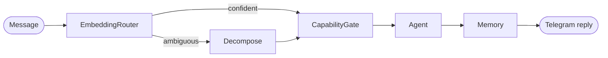

# Ze

**A self-hosted personal AI assistant on Telegram.**

Ze routes every message through a LangGraph orchestration layer to specialised agents — research, calendar, email, workflows, long-running goals, and more. It remembers context, asks before risky actions, and can reach out proactively. All inference goes through [OpenRouter](https://openrouter.ai); you bring your own API keys and host it yourself.

<p align="center">
  <a href="https://github.com/joaoajmatos/ze/actions/workflows/ci.yml"></a>
  
  
  
</p>

---

## Table of contents

- [Features](#features)
- [How it works](#how-it-works)
- [Quick start](#quick-start)
- [Configuration](#configuration)
- [Agents](#agents)
- [Telegram commands](#telegram-commands)
- [Development](#development)
- [Project structure](#project-structure)
- [Deployment](#deployment)
- [Documentation](#documentation)
- [Security](#security)

---

## Features

- **Multi-agent routing** — local embeddings (`all-MiniLM-L6-v2`) pick the right agent; ambiguous requests are decomposed by a small LLM fallback.
- **Capability gate** — per-intent modes (`autonomous`, `confirm`, `draft_only`, `disabled`) with inline Yes/No/Edit keyboards and configurable timeouts.
- **Memory** — semantic retrieval over facts and episodes (pgvector), nightly consolidation, and a synthesised user profile.
- **Google Calendar & Gmail** — read, create, update, and draft/send with OAuth2; destructive actions require confirmation.
- **Workflows & reminders** — recurring scheduled tasks and one-off NL-time reminders with APScheduler persistence.
- **Goals** — multi-week autonomous objectives with milestones, verification gates, and pause/resume.
- **Proactive pushes** — morning briefings, calendar reminders, workflow failure alerts, and weekly insights.
- **Multimodal** — voice notes (Whisper via OpenRouter) and image understanding.
- **Persona profiles** — named profiles with TARS-style numeric dials (`/persona`).
- **Contacts** — person tracking extracted from email, calendar, and conversation.
- **Cost telemetry** — per-flow token usage and reconciliation (`/costs`).
- **Prospecting** — target research, browser sidecar enrichment, and outreach drafting.

Ze is built for **one user**: a single allowed Telegram chat ID, no multi-tenancy, no built-in auth UI.

---

## How it works

```
Telegram message
    → embed + route (local) ──ambiguous──→ decompose (Haiku)
    → fetch context (pgvector)
    → capability gate
    → agent.run (tools + ReAct loop)
    → write memory
    → reply via Telegram Bot API
```



Graph state is persisted in Postgres via LangGraph `AsyncPostgresSaver`, so confirmation flows survive restarts. See [docs/architecture.md](docs/architecture.md) for the full node map.

---

## Quick start

### Prerequisites

- Python **3.12+**
- [uv](https://docs.astral.sh/uv/) — `curl -LsSf https://astral.sh/uv/install.sh | sh`
- Docker (for local Postgres)
- API keys: [OpenRouter](https://openrouter.ai), [Tavily](https://tavily.com) (web search)
- A Telegram bot token from [@BotFather](https://t.me/BotFather)

### Run locally

```bash
git clone https://github.com/joaoajmatos/ze.git
cd ze

make install

cp .env.example .env
# Fill in OPENROUTER_API_KEY, TAVILY_API_KEY, ZE_API_KEY,
# TELEGRAM_BOT_TOKEN, TELEGRAM_ALLOWED_CHAT_ID, etc.

make db-up
make migrate

make dev-poll
```

Send a message to your bot in Telegram — responses come from your machine.

**Dev modes:** `make dev-poll` uses long-polling (no public URL). `make dev` starts the REST API on `:8000` without Telegram. Production uses webhooks on Fly.io — see [docs/deployment.md](docs/deployment.md).

Optional Google integration (Calendar + Gmail):

```bash
make google-auth
```

---

## Configuration

| Layer | Where | What |
|---|---|---|
| Secrets | `.env` | API keys, DB URLs, Telegram token, allowed chat ID |
| Structure | `config/config.yaml` | Routing, models, persona, memory, proactive jobs, per-agent config |
| Locales | `config/locales/` | Progress message strings (`en`, `pt`) |

Copy `.env.example` to `.env` before starting. Required variables:

| Variable | Description |
|---|---|
| `OPENROUTER_API_KEY` | All LLM calls |
| `TAVILY_API_KEY` | Research agent web search |
| `ZE_API_KEY` | Bearer token for REST endpoints |
| `TELEGRAM_BOT_TOKEN` | From @BotFather |
| `TELEGRAM_ALLOWED_CHAT_ID` | Your personal chat ID (integer) |
| `DATABASE_URL` | asyncpg URL (default: local Docker Postgres) |
| `PUBLIC_URL` | HTTPS base URL in production (e.g. `https://ze.fly.dev`) |
| `TELEGRAM_WEBHOOK_SECRET` | Webhook verification secret (production) |

Agent capabilities live under `agents.<name>.capabilities` in `config/config.yaml`. Config hot-reloads on `SIGHUP` without restart.

Full reference: [docs/configuration.md](docs/configuration.md).

---

## Agents

| Agent | Role |
|---|---|
| **research** | Web search (Tavily) + synthesis |
| **companion** | Reasoning, brainstorming, writing help |
| **calendar** | Google Calendar CRUD + availability |
| **email** | Gmail read, draft, send, archive |
| **workflow** | Named recurring / scheduled multi-step tasks |
| **reminders** | One-off NL-time reminders |
| **prospecting** | Target research, enrichment, outreach drafts |
| **goals** | Multi-week autonomous objectives with milestones |

Each agent is configured in `config/config.yaml` (`enabled`, `model`, `tools`, `timeout_seconds`, `intent_map`, `capabilities`). To add one, see [docs/adding-an-agent.md](docs/adding-an-agent.md).

---

## Telegram commands

| Command | Description |
|---|---|
| `/new` | Start a fresh conversation thread |
| `/costs` | Token usage and spend breakdown |
| `/memory` | Inspect stored facts and episodes |
| `/persona` | Switch profile or tune dials (`humor`, `directness`, …) |
| `/contacts` | Browse and search tracked contacts |

Ordinary messages are routed automatically — no slash command needed.

---

## Development

```bash
make help           # all targets

make test           # fast tests (skips embedding model load)
make test-all       # includes slow embedding tests
make lint           # ruff

make migrate        # apply DB migrations
make db-reset       # drop and recreate database

make docker-up      # Postgres + backend via docker-compose
```

**Conventions:** domain types are dataclasses (not Pydantic outside the API layer), constructor injection everywhere, structlog for logging, typed errors from `ze/errors.py`. Tests mirror `ze/` under `tests/` with mocked DB and LLM clients. See [CLAUDE.md](CLAUDE.md) for the full contributor guide.

---

## Project structure

```
ze/
├── ze/                    # Application package
│   ├── api/               # FastAPI, webhook handler, REST routes
│   ├── agents/            # Agent registry and implementations
│   ├── orchestration/     # LangGraph graph, nodes, state
│   ├── routing/           # Embedding router + complexity estimator
│   ├── memory/            # Facts, episodes, consolidation
│   ├── telegram/          # ZeBot, keyboards, session store
│   ├── proactive/         # Briefings, reminders, insights
│   ├── goals/             # Goal store, planner, executor
│   ├── workflow/          # Workflow store and scheduler
│   └── container.py       # Dependency wiring
├── config/
│   └── config.yaml        # Structural config (agents, routing, persona, …)
├── migrations/versions/   # Alembic SQL migrations
├── tests/                 # Test suite (mirrors ze/)
├── specs/                 # Design specs per module
├── docs/                  # Architecture, deployment, guides
├── Dockerfile
├── docker-compose.yml
├── fly.toml
└── Makefile
```

---

## Deployment

Production target is [Fly.io](https://fly.io) with attached Postgres. Pushes to `main` run CI (ruff + pytest) and can trigger deploy via GitHub Actions.

```bash
fly deploy
fly secrets set OPENROUTER_API_KEY=... TELEGRAM_BOT_TOKEN=... TELEGRAM_WEBHOOK_SECRET=...
```

Step-by-step setup: [docs/deployment.md](docs/deployment.md).

---

## Documentation

| Doc | Topic |
|---|---|
| [docs/architecture.md](docs/architecture.md) | System design, graph flow, modules |
| [docs/configuration.md](docs/configuration.md) | Env vars and YAML reference |
| [docs/deployment.md](docs/deployment.md) | Fly.io setup and operations |
| [docs/workflows.md](docs/workflows.md) | Workflow modes and scheduling |
| [docs/goals.md](docs/goals.md) | Long-running goals and gates |
| [docs/scheduled-jobs.md](docs/scheduled-jobs.md) | Proactive jobs and memory lifecycle |
| [docs/adding-an-agent.md](docs/adding-an-agent.md) | Authoring a new agent |
| [docs/channels.md](docs/channels.md) | Outbound communication channels |
| [docs/eval.md](docs/eval.md) | MCP eval server for agent testing |
| [specs/](specs/) | Module-level design specs (source of truth) |

---

## Security

Ze is **single-user by design**. Lock it down before exposing anything to the internet:

1. Set `TELEGRAM_ALLOWED_CHAT_ID` to your personal chat ID — all other chats are ignored.
2. Use a strong `ZE_API_KEY` for REST access (`make generate-ze-api-key`).
3. Keep `.env` out of version control; use Fly secrets in production.
4. Review `agents.*.capabilities` — prefer `confirm` or `draft_only` for send/delete operations.

There is no built-in multi-user isolation. Do not deploy Ze as a shared service without substantial hardening.

---

## Stack

| Layer | Technology |
|---|---|
| Runtime | Python 3.12 · FastAPI · uvicorn |
| Orchestration | LangGraph · AsyncPostgresSaver |
| Bot | aiogram 3.x (Telegram) |
| LLM gateway | OpenRouter |
| Embeddings | `all-MiniLM-L6-v2` (local) |
| Database | PostgreSQL 16 + pgvector |
| Migrations | Alembic (raw SQL) |
| Deploy | Fly.io · Docker |
