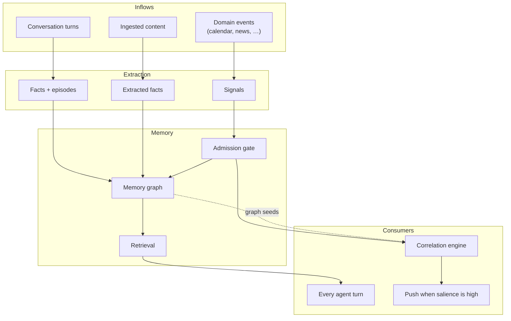
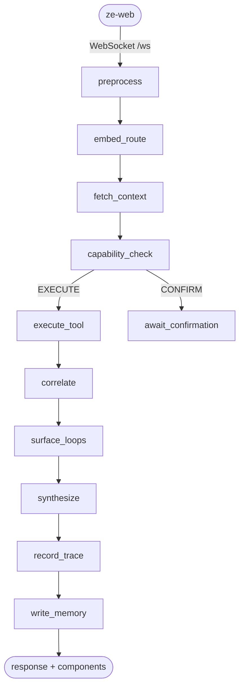

<div align="center">

# Ze

**Jarvis. Make no mistakes.**

A self-hosted personal AI assistant. Single-user, spec-first, somewhere in the middle of becoming something genuinely useful.

<p>
  <a href="https://github.com/joaoajmatos/ze/actions/workflows/ci.yml"></a>
  
  
  
  
</p>

</div>

---

## What this is

An honest attempt at building a personal AI that does more than answer questions.

The objective: an assistant that holds context across weeks, works in the background, and connects things that happen in separate parts of your life — calendar, email, news, long-running projects. Not a chat window that resets. Something closer to Jarvis. That's the whole brief.

It isn't there yet. But 110+ shipped phases in, the infrastructure is real and it's getting closer.

---

## Where it is now

Python/FastAPI backend, LangGraph orchestration, React web client, plugin-per-domain architecture. Routing uses local embeddings — zero LLM calls until an agent needs to act. All LLM traffic goes through OpenRouter. Graph state is checkpointed in Postgres and survives restarts.

- **ze-web** — React SPA (Feature-Sliced Design); REST types and client generated from OpenAPI via `@ze/client`.

### Goal engine

Hand Ze an objective and it decomposes into milestones, dispatches them to specialist agents on a schedule, pauses at verification gates with a progress narrative, replans on failure, and writes a retrospective when it finishes. Steer mid-flight by talking — no slash commands. Background sweep runs every 15 minutes regardless of whether you're online.

Goals are the heavyweight, declared end of Ze's executive function. Most real commitments never get declared as a goal.

### Open loops

Most of what someone means to follow up on is smaller than a goal: a promise made in an email thread, a decision left pending, a project quietly stalling because a dependency didn't land. `ze-worldstate` tracks these as open loops — `suspected → active → drifting → closed | dropped` — extracted from conversation, email, calendar, and ingestion. Confidence decays on its own; a contradiction or a missed deadline moves a loop to `drifting`. Drifting loops surface inline in the next relevant conversation, or push through ntfy once they clear a salience bar shared with the correlation engine's daily budget.

Goals and open loops are Ze's two hands of executive function today: one heavyweight and declared, one lightweight and ambient. Together they're the shipped first slice of what the doctrine calls **active concerns** — the fourth face of Ze's world-state, the model of you the rest of the system attaches to. See [the doctrine](specs/arch/ze-doctrine.md) and [cognitive architecture](docs/cognitive-architecture.md).

### Memory

Facts and episodes extracted after each turn, consolidated nightly, profile synthesized weekly. Goal learnings promoted to long-term memory on completion. `pgvector` for retrieval.

### Dreaming

Every night Ze runs an offline memory improvement loop — sleep pass then dream pass. The sleep pass replays high-priority episodes, compresses old sessions, deduplicates facts, and identifies schema and policy clusters using only structural analysis (no LLM calls). The dream pass then synthesizes those clusters into insights, procedures, and plan stress-tests using a haiku-class generator.

Nothing synthetic goes straight to memory. Every artifact passes three cheap pre-gates (NLI groundedness, embedding novelty, retrievability) and two adversarial LLM critic calls at sonnet-class before reaching a morning integration step that enforces session-diversity and temporal-spread requirements. Promoted facts carry full lineage for per-run rollback. Borderline cases surface in the morning briefing for review. Synthetic facts that go uncorroborated for 90 days are automatically expired.

The design is drawn from neuroscience (NREM/REM ordering, targeted memory reactivation) and ML (PER, Constitutional AI-style critic filtering, generative replay safety). It's the first layer of Ze becoming genuinely self-improving rather than just accumulating facts.

### How Ze gets sharper

Memory isn't a single inflow. Everything feeds the same substrate:


```mermaid
flowchart TB
    subgraph inputs["Inflows"]
        CT["Conversation turns"]
        IC["Ingested content"]
        DE["Domain events\n(calendar, news, …)"]
    end

    subgraph extraction["Extraction"]
        FE["Facts + episodes"]
        EF["Extracted facts"]
        SIG["Signals"]
    end

    subgraph memory["Memory"]
        AG["Admission gate"]
        MG["Memory graph"]
        RET["Retrieval"]
    end

    subgraph out["Consumers"]
        AGT["Every agent turn"]
        CE["Correlation engine"]
        PUSH["Push when salience is high"]
    end

    CT --> FE
    IC --> EF
    DE --> SIG

    FE --> MG
    EF --> MG
    SIG --> AG
    AG --> MG

    MG --> RET
    RET --> AGT

    AG --> CE
    MG -.->|graph seeds| CE
    CE --> PUSH
```

Conversations write what Ze learns from talking. Ingestion (`ze-ingestion`) feeds knowledge from any URL, PDF, YouTube video, or file — extracted facts land in the same store. Domain plugins emit `SignalSource` events; Ze scores them for relevance, writes them to the memory graph, and feeds them into the correlation engine. Goals promote learnings on completion. Every inflow compounds.

The design intent is that Ze gets sharper without being explicitly fed. Drop a PDF in. Share a video. The facts join everything else Ze already knows.

Every domain plugin also declares a `DataDomain` — an export, import, and delete contract. The portability service honours it. You own the data at every layer.

### Proactive surface

Ze doesn't wait to be asked. Morning briefings, calendar reminders, weekly insights, goal suggestions, stuck-goal alerts, news fetch — all background jobs, configurable in `config.yaml`. Offline push goes through ntfy; the in-app notification center (REST + WebSocket) surfaces the same events while you're in ze-web.

### Agents

Research, companion, calendar, messenger, reminders, workflow, goals, prospecting, news, ingestion, finance. Each runs in a ReAct loop via `BaseAgent`; tool access is gated per-agent.

<details>
<summary>Agent reference</summary>

| Agent | Domain | Default posture |
|---|---|---|
| `research` | Web search + synthesis, delegation | Autonomous |
| `companion` | Reasoning, writing, conversation | Autonomous |
| `calendar` | Google Calendar CRUD + availability | Read auto · writes confirm |
| `messenger` | Cross-channel messaging (Gmail) | Read auto · draft-first |
| `reminders` | NL reminders + proactive push | Autonomous |
| `workflow` | Recurring multi-step tasks | Read auto · manage confirm |
| `goals` | Multi-week autonomous objectives | Read auto · writes confirm |
| `prospecting` | Browser-sidecar research + outreach | Autonomous |
| `news` | Personalized RSS headlines + search | Autonomous |
| `ingestion` | URL / PDF / video / audio / text → memory | Autonomous |
| `finance` | Portfolio, spending, recurring expenses (Trading212 + CSV) | Read auto · recurring review confirms |

</details>

### Plugin extension surface

`ZePlugin` is the seam. A domain package hooks in by declaring what it contributes:

| Hook | What it provides |
|---|---|
| `agents()` | Agents registered into the routing graph |
| `ingestion_extractors()` | Domain-specific extractors (e.g. `TransactionExtractor` for PDFs) |
| `ingestion_fetchers()` | Custom content fetchers (e.g. Notion, proprietary APIs) |
| `signal_sources()` | Domain events fed into the correlation pipeline |
| `data_domains()` | Export / import / delete contract for every table the plugin owns |
| `memory_policies()` | Per-agent retrieval strategy from the memory graph |
| `channels()` | Outbound communication channels (email, etc.) |
| `ui_contributions()` | Nav items, settings sections, plugin pages in ze-web |
| `rest_routes()` | Plugin-owned REST routers under `/api/v0/` |

The hooks compose. The finance plugin registers a `TransactionExtractor` so that ingesting a bank statement produces structured transaction facts — which land in memory, which surface in retrieval, which the correlation engine can cross with calendar and news. That chain is the whole point.

---

## Where it's going

Executive function now has two hands — goals and open loops — but nothing yet ranks what deserves attention across both, plus the correlation engine's hypotheses, against one shared attention budget. That cross-concern prioritization is the near-term target (`specs/arch/attention-arbitration.md`).

Concretely, the goal engine still needs to carry a full personal project across weeks with minimal intervention — research, plan, execute, verify, iterate, report.

Beyond that: a first-class model of people and projects as evolving states (contacts today are a directory, not a relationship model), one calibrated confidence scale across the system's several independent decay schemes, and deeper signal coverage as more domain plugins land.

---

## How a message flows

Every turn runs through a LangGraph graph checkpointed in Postgres.


```mermaid
flowchart TD
    A([ze-web]) -->|WebSocket /ws| PRE[preprocess]
    PRE --> ER[embed_route]
    ER --> FC[fetch_context]
    FC --> CG[capability_check]
    CG -->|EXECUTE| EX[execute_tool]
    CG -->|CONFIRM| AC[await_confirmation]
    EX --> CO[correlate]
    CO --> SL[surface_loops]
    SL --> SY[synthesize]
    SY --> RT[record_trace]
    RT --> WM[write_memory]
    WM --> R([response + components])
```

See [docs/architecture.md](docs/architecture.md) for the full flow and node-by-node detail.

---

## Monorepo

```
apps/           ze-api · ze-web
plugins/        personal · messenger · calendar · news · prospecting · finance
core/           ze-core · ze-agents · ze-automation · ze-communication · ze-plugin
                ze-worldstate · ze-memory · ze-proactive · ze-correlation · ze-data
                ze-ingestion · ze-onboarding · ze-seed · ze-browser · ze-notifications
                ze-components · ze-logging · …
packages/       ze-sdk · ze-client · ze-ui
integrations/   ze-google (GmailChannel) · ze-trading212 · ze-yt
specs/          one spec per phase, written before the code
```

| Layer | Tech |
|---|---|
| Runtime | Python 3.12 · FastAPI · LangGraph · AsyncPostgresSaver |
| Client | React · Vite · TypeScript · Tailwind |
| LLM | OpenRouter · local embeddings (multilingual MiniLM) |
| Data | PostgreSQL 16 + pgvector |
| Push | ntfy (offline) · in-app notification center · WebSocket `/ws` |

---

## Quick start

**Prerequisites:** Python 3.12+, [uv](https://docs.astral.sh/uv/), [bun](https://bun.sh), Docker, [OpenRouter](https://openrouter.ai) key, ntfy for push.

```bash
git clone https://github.com/joaoajmatos/ze.git && cd ze
make install && make web-install

cp apps/ze-api/.env.example apps/ze-api/.env
make db-up && make migrate
make dev-full    # backend :8000 + web :5173
```

Google Calendar + Gmail: `make google-auth` · Config: [docs/configuration.md](docs/configuration.md)

---

## Development

```bash
make test              # ze-api (fast)
make test-<name>       # any package — docs/testing.md
make test-all          # full suite
make eval              # agent evals (make dev-eval first)
```

Every package has a README. Conventions: [CONTRIBUTING.md](CONTRIBUTING.md)

---

## Documentation

Full index (grouped by audience): [docs/README.md](docs/README.md)

| Doc | Topic |
|---|---|
| [ze-doctrine.md](specs/arch/ze-doctrine.md) | What kind of mind Ze is — the constitutional layer |
| [cognitive-architecture.md](docs/cognitive-architecture.md) | Seven cognitive functions mapped onto packages |
| [architecture.md](docs/architecture.md) | System design, graph flow |
| [package-architecture.md](docs/package-architecture.md) | Monorepo, `ZePlugin`, dependency rules |
| [sdk.md](docs/sdk.md) / [extending-ze.md](docs/extending-ze.md) | SDK reference and how to add agents, plugins, jobs |
| [memory.md](docs/memory.md) / [dreaming.md](docs/dreaming.md) | Memory store and offline sleep/dream loop |
| [goals.md](docs/goals.md) / [workflows.md](docs/workflows.md) | Goal engine and multi-step workflows |
| [frontend.md](docs/frontend.md) / [native-interface.md](docs/native-interface.md) | ze-web and WebSocket / ntfy protocol |
| [configuration.md](docs/configuration.md) / [deployment.md](docs/deployment.md) | Config keys and Fly.io deploy |
| [testing.md](docs/testing.md) / [eval.md](docs/eval.md) | Package tests and MCP evals |
| [specs/](specs/) | Design specs — where Ze is going next |

---

## Security

Single-user by design. Strong `ZE_API_KEY`, secrets out of git, non-guessable ntfy topic. Don't expose as a shared service without hardening.

---

## License

[The Unlicense](UNLICENSE) — public domain. Take it anywhere, zero conditions.
