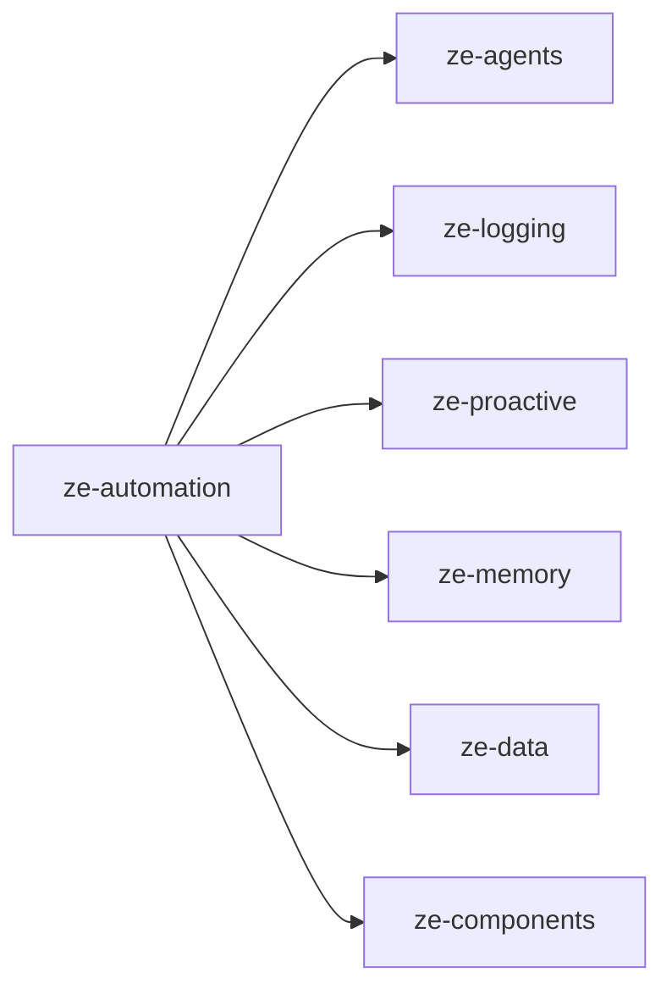

# ze-automation

Shared automation substrate for Ze — goals, workflows, accountability, store protocols, and runtime contracts.

## Role in Ze

Goals (multi-week autonomous objectives, verification gates, replanning) and workflows (recurring multi-step tasks) are Ze's two declared, heavyweight forms of executive follow-through. `ze-automation` owns both engines end to end — types, Postgres stores, planners, executors, schedulers, and the proactive jobs that run them in the background — so that `ze-personal` and other domain plugins stay focused on persona and contacts rather than re-implementing multi-step execution.

It also owns accountability: the weekly narrative and cost-anomaly detection that turn what the automation engines did into a summary a user can actually read.

### Key features

- Goals (`goals/`) — `GoalStore`, `GoalPlanner`, `GoalExecutor`, execution traces, adaptive replanning, stuck-goal detection, cross-goal reuse hints
- Workflows (`workflow/`) — `WorkflowStore`, `WorkflowPlanner`, `WorkflowScheduler`, step validation, retry, revision history (`workflow_revisions`)
- Accountability (`accountability/`) — `AccountabilityStore`, weekly activity narrative, cost anomaly detection
- Agents (`agents/`) — `GoalAgent`, `WorkflowAgent`, the conversational surface for both engines
- Jobs (`jobs/`) — `AccountabilityJob`, `CostAnomalyJob`, `GoalNarrativeJob`, `GoalSuggestionJob`, `StuckGoalJob`, all scheduled via `ze-proactive`
- `runtime/contracts.py` — `AutomationPlanner` / `AutomationStore` protocols other packages code against instead of importing concrete goal/workflow types

### Integration

`ze-api`'s container calls into `bootstrap.py` to construct the goal and workflow stacks, register their proactive jobs, and wire `GoalAgent` / `WorkflowAgent` into the routing graph — this package is wired directly by `ze-api`, not through the `ZePlugin` discovery path (it is core infrastructure, not a domain plugin). `ze-personal`, `ze-calendar`, and other plugins depend on `ze-automation` for goal/workflow types via `ze_sdk.automation`, never by importing `ze_automation` directly from plugin code.

## Responsibilities

| Module | What it provides |
|---|---|
| `goals/` | `GoalStore` protocol + `PostgresGoalStore`, `GoalPlanner`, `GoalExecutor`, `GoalSuggestionStore`, types |
| `workflow/` | `WorkflowStore` protocol + `PostgresWorkflowStore`, `WorkflowPlanner`, `WorkflowScheduler`, retry, revision summaries, validation, types |
| `accountability/` | `AccountabilityStore`, `ActivitySummary` / `AnomalyRecord` types, narrative building |
| `agents/` | `GoalAgent`, `WorkflowAgent` |
| `jobs/` | Proactive job wrappers around the goal/workflow/accountability engines |
| `runtime/contracts.py` | `AutomationPlanner`, `AutomationStore` — shared protocols |
| `graph/routing_context.py` | Goal/workflow context injected into the LangGraph routing node |
| `bootstrap.py` | DI wiring — stores, planners, executors, schedulers, jobs |
| `rest.py` | Workflow list/detail/execution/revision REST handlers |
| `migrations/` | `zc006`–`zc009` (goal traces/suggestions/stuck/reuse), `zc011` (workflows), `zc014` (accountability), `zc021`/`zc025`/`zc026` (workflow execution + revisions) — continues the `ze-core` `zc` migration chain |

## Dependencies



Third-party: `asyncpg`, `apscheduler`.

## Usage

```python
from ze_sdk.automation import Goal, GoalStore, Workflow, WorkflowStore, WorkflowScheduler
```

Plugin code imports goal/workflow types from `ze_sdk.automation`, never `ze_automation` directly. `ze-api` is the only consumer that imports this package by name, at container construction time.

## Testing

From the repo root:

```bash
make test-automation
```

See [docs/testing.md](../../docs/testing.md).
