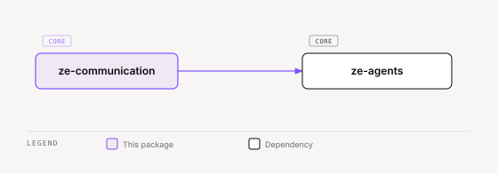

# ze-communication

Channel contract for Ze — outbound/inbound channel ABCs, message and thread types, and the channel registry.

## Role in Ze

Ze talks to the user, and on the user's behalf, over more than one surface — email today, other channels later. `ze-communication` defines what a "channel" is, independent of which service backs it, so that agents and plugins send and poll messages through one contract instead of one integration per provider.

Concrete channels live outside this package: `GmailChannel` in `ze-google`, for example. `ze-communication` owns only the contract and the registry that resolves a `ChannelType` to a live channel instance at runtime.

### Key features

- `Channel` ABC — `send()`, `get_thread()`; the outbound contract every channel implements
- `InboundChannel` ABC — adds `poll_new_messages()`, `channel_id`, `supports_push`, and an optional `webhook_verifier()` for push-capable channels
- `ChannelRegistry` — resolves `ChannelType` → `Channel`, and exposes the inbound subset for polling/webhook wiring
- Shared types: `Message`, `SentMessage`, `Thread`, `ThreadMessage`, `InboundMessage`, `ChannelHandle`, `ChannelType`
- `WebhookPayload` / `WebhookVerifier` — contract for push-capable inbound channels (Phase 86)

### Integration

`ze-api` builds the `ChannelRegistry` at container construction time from every `Channel` a plugin contributes via `ZePlugin.channels()`, and exposes it on the DI container. Agents (e.g. `messenger`) call `ChannelRegistry.get()` to send, and background jobs call `inbound_channels()` to poll. Plugin code accesses these types via `ze_sdk.channels`, never by importing `ze_communication` directly.

## Responsibilities

| Module | What it provides |
|---|---|
| `types.py` | `ChannelType`, `ChannelHandle`, `Message`, `SentMessage`, `Thread`, `ThreadMessage`, `InboundMessage` |
| `channel.py` | `Channel` (outbound ABC), `InboundChannel` (adds polling/push) |
| `registry.py` | `ChannelRegistry` — lookup by type and by channel id |
| `webhook.py` | `WebhookPayload`, `WebhookVerifier` ABC |

## Dependencies



<sub>[Interactive version](../../docs/diagrams/core/ze-communication/dependencies.html)</sub>

No third-party dependencies beyond the standard library.

## Usage

```python
from ze_sdk.channels import Channel, InboundChannel, ChannelType, Message
```

Plugins implement `Channel` (or `InboundChannel` for polling/push) and register instances via `ZePlugin.channels()`; `ze-api` wires them into the shared `ChannelRegistry`.

## Testing

From the repo root:

```bash
make test-communication
```

See [docs/testing.md](../../docs/testing.md).
