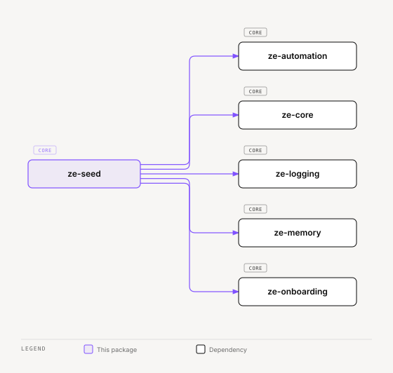

# ze-seed

Dev data seeder for Ze — curated narrative fixtures for local development.

## Role in Ze

A fresh `make db-up && make migrate` gives an empty database, which makes it hard to develop or demo anything that depends on history: memory, goals, contacts, the automation substrate. `ze-seed` populates a local database with a coherent, hand-written persona narrative instead of random fixtures, so a developer's first `make dev-full` looks like a real, weeks-old Ze instance.

It is a dev-only tool. It is never imported by `ze-api` at runtime and ships no migrations of its own — it writes through the same stores every other package already owns.

### Key features

- `SeedDomain` — namespace-isolated `clear()` / `apply()` pair for one data slice, ordered by `seed_order`
- `DevDataSeeder` — runs domains in dependency order, clearing before applying when `force=True`
- `SeedContext` — bundles the stores a domain needs (`memory_store`, `goal_store`, `person_store`, …), built from the running `ze-api` container via `SeedContext.from_container()`
- A single persona narrative (`narrative/loader.py`) shared across domains, so seeded memory, goals, and engine state tell one consistent story

### Integration

Run from the `ze-api` workspace, where the full container (and its plugins) is importable:

```bash
cd apps/ze-api && uv run python -m ze_seed apply
```

`collect_seed_domains()` gathers every registered `SeedDomain` across the memory, automation, and engine slices; `DevDataSeeder.apply()` clears each domain (highest `seed_order` first) then applies them in ascending order so dependent domains see their prerequisites already seeded.

## Responsibilities

| Module | What it provides |
|---|---|
| `service.py` | `DevDataSeeder`, `collect_seed_domains()` |
| `domain.py` | `SeedDomain` — the clear/apply contract each data slice implements |
| `context.py` | `SeedContext` — store bundle passed to every domain, built from the running container |
| `domains/memory.py` | Seeds facts, episodes, and profile facets |
| `domains/automation.py` | Seeds goals, milestones, and workflow state |
| `domains/engine.py` | Seeds messages, sessions, and persona state |
| `narrative/loader.py` | `load_persona()` — the shared fixture narrative every domain seeds from |
| `__main__.py` | `python -m ze_seed apply` entry point |

## Dependencies



<sub>[Interactive version](../../docs/diagrams/core/ze-seed/dependencies.html)</sub>

Third-party: `pyyaml`.

## Usage

```bash
cd apps/ze-api
uv run python -m ze_seed apply
```

Requires a running Postgres (`make db-up`) with migrations applied (`make migrate`). Re-running `apply` clears and re-seeds every domain by default.

## Testing

From the repo root:

```bash
make test-seed
```

See [docs/testing.md](../../docs/testing.md).
