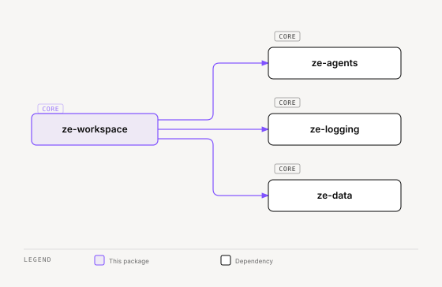

# ze-workspace

Isolated durable workspace — files, shell, and scripting runtimes beside the mind.

## Role in Ze

Ze's agents need a computer: a place to write files, run commands, and execute approved skill scripts. That computer is a separate sidecar. This package is the Python client, gate, tools, and Postgres store that talk to it.

The sidecar is not a browsing session. Web pages stay in `ze-browser`. This package must not be imported by `ze-core` or `ze-agents`; `ze-api` wires it and merges the tools at runtime.

### Key features

- `WorkspaceClient` — async HTTP client for the sidecar
- `WorkspaceGate` — mode × action × origin → allow, confirm, plan, or deny
- `workspace_*` tools — list, read, write, delete, run, run skill script, ingest
- Durable `workspace_state` and `workspace_runs` in Postgres
- REST routes under `/api/v0/workspace`

### Integration

`ze-api` builds the stack, injects `WorkspaceClient` / `WorkspaceGate` / `WorkspaceStore`, and calls `workspace_tools.configure(...)`. `BaseAgent.agentic_loop` merges a fixed `WORKSPACE_TOOLS` set. Unattended goal/workflow runs use a duck-typed gate in `ze-automation` so that package never imports `ze_workspace`.



<sub>[Interactive version](../../docs/diagrams/core/ze-workspace/dependencies.html)</sub>

## Responsibilities

| Module | What it provides |
|---|---|
| `client.py` | `WorkspaceClient` — async HTTP client for the sidecar |
| `gate.py` | `WorkspaceGate` — mode × action × origin decisions |
| `tools.py` | `workspace_*` `@tool`s; `WORKSPACE_TOOLS` name list |
| `store.py` | `workspace_state` and `workspace_runs` |
| `rest.py` | FastAPI routes: status, files, mode, reset |
| `sanitize.py` | Path confinement and secret redaction |
| `types.py` | Mode, action, origin, run, and file types |
| `errors.py` | `WorkspaceError` and subtypes |
| `bootstrap.py` | Container wiring helpers |

## Dependencies

`ze-agents`, `ze-logging`, `ze-data`, `httpx`, `asyncpg`. `ze-core` and `ze-agents` must not depend on this package.

## Usage

The sidecar runs as a separate Docker service (`sidecar/workspace/`). Point Ze at it with `WORKSPACE_SERVICE_URL`.

```python
from ze_workspace.client import WorkspaceClient

client = WorkspaceClient(
    base_url="http://ze-workspace.internal:8080",
    token="...",
    timeout=120,
)
stat = await client.stat()
```

## Configuration

| Setting | Description |
|---|---|
| `WORKSPACE_SERVICE_URL` | URL of the workspace sidecar |
| `WORKSPACE_API_TOKEN` | Bearer token for the sidecar control API |
| `WORKSPACE_TIMEOUT_SECONDS` | Per-request HTTP timeout |

See [docs/workspace.md](../../docs/workspace.md) for modes, isolation, and local/Fly setup.
See [docs/skills.md](../../docs/skills.md) for how skill scripts reach this sidecar.

## Testing

From the repo root:

```bash
make test-workspace
```

See [docs/testing.md](../../docs/testing.md).
