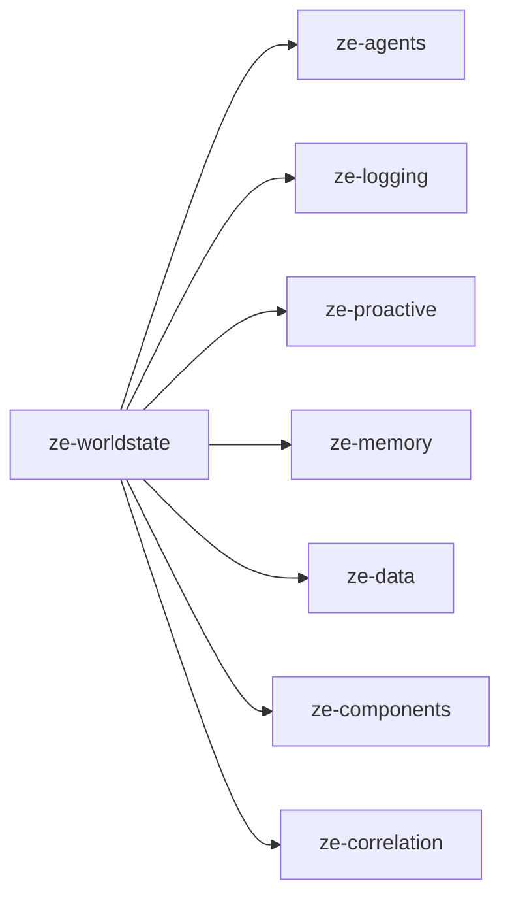

# ze-worldstate

Open-loop substrate for Ze — active concerns, honest provenance, evidence-linked confidence.

## Role in Ze

Goals are the heavyweight, explicitly-declared end of Ze's executive function. Most real commitments never get declared as a goal: a promise made in an email thread, a decision left pending, a project quietly stalling because a dependency didn't land. `ze-worldstate` tracks these as **open loops** — the lightweight, ambient half of executive function, and the shipped first slice of what `specs/arch/ze-doctrine.md` calls **active concerns**, the fourth face of Ze's world-state.

An open loop moves through `suspected → active → drifting → closed | dropped`. Confidence decays on its own; a contradiction or a missed deadline pushes a loop into `drifting`. Loops reuse `ze-memory`'s graph tables (`memory_relationships`, a dedicated `open_loop` bucket) for dedup and neighbourhood expansion rather than a parallel model — this package owns loop lifecycle and surfacing, not a second memory store.

### Key features

- `OpenLoop` / `LoopState` — the lifecycle type and its five states
- Extraction (`extraction.py`) — conservative, relevance-gated loop extraction wired into all four inflows: conversation, email, calendar, and ingestion
- Matching (`matching.py`) — entity-overlap + embedding-similarity dedup against existing loops
- Decay (`decay.py`) — confidence decay cascade, invoked at every evidence-writing code path
- Drift (`drift.py`) — deadline computation and contradiction/absence rationale for the `active → drifting` transition
- `LoopSurfacer` (`surfacing.py`) — hedged inline mentions plus a push-bar-gated path (`ze_correlation`'s shared push budget) for `drifting` loops
- Review (`review.py`) — confirm / close / drop lifecycle transitions
- Jobs (`jobs/`) — `DriftSweepJob`, `PushSweepJob`, `StaleSuspicionJob`, all scheduled via `ze-proactive`

### Integration

`ze-api`'s container calls `build_worldstate_stack()` at startup, which wires `PostgresLoopStore` against the shared `ze-memory` graph store. The conversation, messenger, calendar, and ingestion inflows each call a loop extractor (`ze_worldstate.inflow`) after writing their own facts. `GET/POST /api/v0/loops` (`rest.py`) exposes review actions to `ze-web`'s `widgets/loop-review`.

## Responsibilities

| Module | What it provides |
|---|---|
| `types.py` | `OpenLoop`, `LoopState`, `LoopProvenance`, `EvidenceRef`, `DriftingLoopMention` |
| `store.py` | `LoopStore` protocol, `PostgresLoopStore` |
| `extraction.py` | Relevance-gated loop extraction from inflow text |
| `matching.py` | Entity-overlap + embedding dedup against existing loops |
| `decay.py` | Confidence decay cascade, called at the evidence-writing code path |
| `drift.py` | Drift deadline computation and rationale composition |
| `surfacing.py` | `LoopSurfacer` — hedged inline mentions, push-bar-gated ntfy path |
| `review.py` | Confirm / close / drop lifecycle transitions |
| `inflow.py` | Wiring helpers for the four inflows (conversation, email, calendar, ingestion) |
| `jobs/` | `DriftSweepJob`, `PushSweepJob`, `StaleSuspicionJob` |
| `bootstrap.py` | `build_worldstate_stack()` — DI wiring for `ze-api` |
| `rest.py` | `GET/POST /api/v0/loops` handlers |
| `migrations/` | `zw001` (open_loops table), `zw002` (drift columns) |

## Dependencies



Third-party: `asyncpg`.

## Usage

```python
from ze_worldstate.bootstrap import build_worldstate_stack
from ze_worldstate.types import OpenLoop, LoopState

stack = build_worldstate_stack(shared, settings)
loops = await stack.loop_store.list(states=[LoopState.ACTIVE])
```

Wired by `ze-api`, not imported directly by plugin code — plugins that want to emit loop-relevant events use their existing `SignalSource` / inflow hooks, which `ze-worldstate` already listens to.

## Testing

From the repo root:

```bash
make test-worldstate
```

See [docs/testing.md](../../docs/testing.md).
