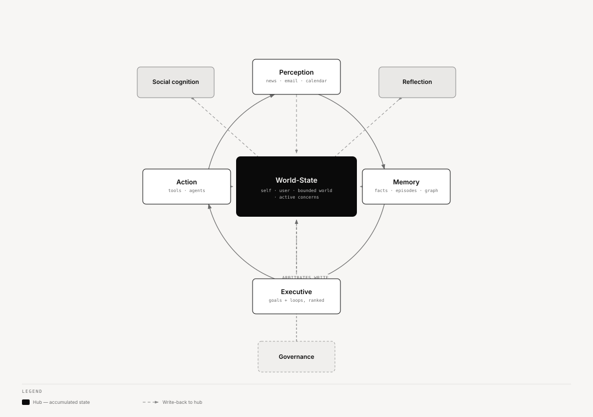

# Ze — Cognitive Architecture

> **Companion to** `specs/arch/ze-doctrine.md` (the constitutional layer).
> This document is a **lens, not a rewrite.** The package/plugin split in
> `docs/package-architecture.md` stays exactly as it is. What this adds is a second way to
> read the same packages: by the *enduring cognitive function* they serve, so that gaps in
> Ze's "mind" are visible even when no single package is missing.

---

## Why a second taxonomy

Ze is organized by **domain** (calendar, news, finance, memory, automation…). That is the
right axis for ownership, dependencies, and migrations. But domains are not the axis that shows
whether a *mind* is complete. A system can have excellent domain packages and still be missing
an entire cognitive function — and it stays invisible, because no package is "missing";
a *capability* is.

So we add a functional taxonomy alongside it. A subsystem is not primarily "the news plugin"; it is
**perception that happens to be sourced from news**. Reading Ze this way used to make one thing
immediately clear: Ze perceived, remembered, reflected, and acted well, but its executive
function was under-built. `core/cognition/ze-worldstate` (Phases 109–110) and `core/arbitration/ze-priority`
(Phases 123, 127) closed that gap. The remaining gap this lens surfaces is **social
cognition** — third-party relationship modeling stays thin (see function 4 below).

The seven functions below are from the external architecture review and are adopted verbatim
as the functional vocabulary.

---

## The seven functions, mapped to what exists

Legend: 🟢 substantial · 🟡 partial · 🔴 gap.

[Interactive version](diagrams/docs/cognitive-maturity-matrix.html)

### 1. Perception — turning the outside world into signals

> *calendar, email, web, documents, finance, news, sensors*

Maturity: 🟢 substantial — `ze-calendar`, `ze-messenger`, `ze-news`, `ze-finance`, `ze-browser`,
`ze-ingestion` (web/PDF/audio/image → common content model), `ze-communication` (inbound
channels), signal admission (Phase 55/56).

**State:** strong and broad. The admission gate (`relevance_to_user + intrinsic_magnitude`)
is the right discipline — perception is already relevance-filtered rather than firehose.
**Gap:** "sensors" (location, device, ambient) is unbuilt; not urgent.

### 2. Memory — retaining and structuring experience

> *episodic, semantic, procedural, social, project, temporal*

Maturity: 🟢 substantial — `ze-memory`: facts (semantic), episodes (episodic), procedures
(procedural), events, profile facets, the relationship **graph**, temporal via
`as_of`/timeline (Phase 93), consolidation + dream.

**State:** the deepest function in the system. Genuinely multi-layer.
**Gap:** "project" and "social" memory are *implicit* — they live scattered across contacts,
goals, and episodes rather than as first-class structures. This is the same gap seen from the
memory side: there is no durable "state of project X" or "state of
relationship with Y" that the executive layer can read.

### 3. Executive function — deciding what to do and following through

> *goals, plans, scheduling, follow-through, interruption handling*

Maturity: 🟢 substantial — `ze-automation`: goals (heavyweight, explicit, multi-week), workflows
(multi-step plans), scheduler. `core/cognition/ze-worldstate` (Phases 109–110): open loops — the
lightweight, implicitly-opened active concerns (`suspected → active → drifting →
closed|dropped`), extracted from all four inflows, with drift detection and hedged,
push-bar-gated surfacing. `core/arbitration/ze-priority` (Phase 123, 127): `PriorityView` ranks loops,
goals, and correlation hypotheses together against one shared attention budget, plus
user-directed priority override.

**State: the primary gap is closed; one residual gap remains (see below).** What exists now handles both ends: goals for
objectives deliberately declared, and open loops for the ambient, never-formalized concerns
that make up most of a real life:

- a promise made in an email thread,
- a decision left pending,
- a project quietly drifting because a dependency stalled,
- a "I should look into X" mentioned once and never closed.

**What was missing, now closed (Phase 123, attention arbitration):** continuous prioritization
across everything open at once. `core/arbitration/ze-priority`'s `PriorityView` ranks loops, goals, and
correlation hypotheses together as `Priority`-kind claims, without recomputing what each source
mechanism already scores; the two previously-independent daily push budgets (correlation's and
worldstate's) were consolidated into one shared, atomically-claimed attention budget in
`core/contracts/ze-proactive`. Interruption-handling is now one policy, not per-mechanism. Phase 127
(user-directed priority override) layered a first arbitration case on top: decaying/pinned user
reorderings merge into `PriorityView.rank()` at render time.

**What is still missing:**
- **Loops and goals are deliberately un-unified** (`specs/phases/110-open-loop-drift-surfacing/spec.md`
  FR-014). `PriorityView` ranks both together but does not merge their stores; there is still no
  shared query surface for "everything open right now" beyond that ranked view. Whether and how
  to reconcile the two stores themselves is an open follow-up, not yet specced.

### 4. Social cognition — modelling people and calibrating interaction

> *tone, relationship memory, boundaries, interaction style*

Maturity: 🟡 partial — `ze-personal` persona (tone/dials, interaction style), contacts
(`PersonStore`, channel handles), messenger.

**State:** interaction *style toward the user* is well-modeled (persona dials, identity
block). Modeling of **third parties** — who matters to the user, the state and cadence of
each relationship, boundaries per person — is thin. Contacts are a directory, not a
relationship model. This is the "social memory" gap from function 2, seen from the behavioral
side.

### 5. Reflection — revising the model when not acting

> *consolidation, model revision, conflict detection, uncertainty tracking*

Maturity: 🟢 substantial — `ze-memory` dream (sleep→dream two-pass), nightly consolidation,
weekly insights, NLI contradiction detection (Phase 79), correlation engine (hypotheses with
uncertainty).

**State:** rich — arguably *ahead* of what currently consumes it. The doctrine resolves the
"is dreaming premature?" question: reflection is justified **iff it improves the world-state.**
Today much of its output (synthesized facts, insights) flows back into memory tables rather
than into a live executive layer, because that layer does not yet exist. **Reflection is not
overbuilt; its consumer is underbuilt.** Building executive function retroactively justifies
the reflection investment.

### 6. Action — changing the world on the user's behalf

> *messaging, scheduling, drafting, research, workflows, tool use*

Maturity: 🟢 substantial — Agent roster (research, companion, calendar, email, reminders,
prospecting, news, finance, goals, workflow), `@tool` system, agentic loop, channels for
outbound messaging, server-driven UI for surfacing, `ze-workspace` sidecar for files and
commands, `ze-skills` for reusable instructions and approved skill scripts.

**State:** mature and extensible. Action is not the bottleneck. Per the doctrine, agents are
*replaceable executors that propose changes to the world-state* — they are organs, and the
roster will churn for years without threatening continuity.

### 7. Governance — provenance, consent, reversibility, confidence, correction

> *permissioning, provenance, reversibility, confidence thresholds, user corrections*

Maturity: 🟢🟡 mostly substantial — Capability gate (autonomous/confirm/draft_only/disabled),
confirmation persistence + timeout, workspace modes (Off / Plan / Ask / Auto-edit / Auto),
skill review plus a second executable approval for scripts, provenance tags in memory +
correlation, memory review flows (propose→user reviews), dream rollback lineage, data
portability/delete.

**State:** strong on permissioning and provenance. **Gap:** *confidence* is not yet a
uniform, system-wide signal — it exists per-subsystem (correlation self-rating, fact
confidence) but there is no single calibrated notion the arbitration order can lean on. The
doctrine names this as an open question. Governance is the function that most directly encodes
the doctrine's arbitration precedence.

---

## The shape of the whole mind

Reading the functions in order gives the loop the doctrine implies — a cycle around a shared
spine, not a pipeline with a start and end:

[Interactive version](diagrams/docs/cognitive-loop.html)

- **The world-state is the hub** (doctrine §"The one commitment"). Every function reads from
  and writes to it; nothing holds a competing private truth.
- **Executive function now has a cross-concern view.** `core/cognition/ze-worldstate` gives the "active
  concerns" face a real representation (open loops), and `core/arbitration/ze-priority`'s `PriorityView`
  (Phase 123) ranks loops, goals, and correlation hypotheses together against one shared
  attention budget — closing the "several attention mechanisms" gap this section used to flag.
  What remains open is unifying the *stores* themselves (loops and goals stay deliberately
  separate, per FR-014 above), not the ranking.
- **Governance arbitrates every write** to the hub, in the doctrine's precedence order
  (governance > user-stated > fact > inference > suspicion).

---

## Functions are permanent; implementations are the organs

The reason this lens is worth maintaining alongside the domain taxonomy: the **functions are
the enduring structure**, and the domain packages are replaceable implementations of them. The
news plugin is one implementation of perception; the goals module is one implementation of
executive function. Organs churn over the years; the seven functions do not. This is the sharp
form of "what stays continuous" (`ze-doctrine.md` §The one commitment): not just the
world-state data, but the functional decomposition around it.

It also means each function has a **licensed contribution** to the spine — the claim-kinds it
is allowed to produce. The canonical table lives in the doctrine (`ze-doctrine.md` §The
contribution model); the rule with the most teeth is that **reflection may never emit a fact**
(the dream and correlation engines conclude, they do not observe — their output stays an
inference or suspicion until perception or the user corroborates it). Every contribution is a
*proposal* carrying claim-kind + provenance + confidence, and governance arbitrates. The
`Contribution` type (`core/contracts/ze-plugin`, Phase 124) is now that uniform proposal seam: `Signal`,
`OpenLoop`, the dream pipeline, and the correlation engine all route their writes through it,
and its claim-kind license check is what makes "reflection may never emit a fact" a type-level
guarantee rather than a convention. What the seam does *not* yet do is arbitrate *between*
colliding contributions from different functions — Phase 126 logs when that happens but doesn't
resolve it; see `specs/arch/contribution-seam.md`.

---

## How the two taxonomies coexist

This lens does **not** propose new packages by function, and does not move code. A package
keeps its domain identity; the function is an annotation.

| You want to… | Use which taxonomy |
|---|---|
| Decide where code lives, what depends on what, who owns a table | **Domain** (`package-architecture.md`) — unchanged. |
| Decide whether Ze *as a mind* is complete, and what to build next | **Function** (this doc). |

The one place the function taxonomy became *structural* is executive function: "active
concerns" got its own domain home, `core/cognition/ze-worldstate`, rather than a promotion within
`ze-automation` — see `specs/arch/aperture-decision.md` (ratified) for the resolved decision.

---

## What this implies for sequencing (not a commitment)

The aperture decision is resolved (open loops, ratified). A 2026-07 review session found the
seven-function lens itself was fraying at the seams — six independently scheduled proactive job
families (automation, correlation, worldstate, memory consolidation, dream, notifications) had
each grown their own confidence scheme, provenance vocabulary, and staleness-sweep logic instead
of sharing one. `specs/arch/claim-topology.md`, `specs/arch/contribution-seam.md`, and
`specs/arch/attention-arbitration.md` were scoped to arrest that, and the first two items below
have since shipped:

1. ~~Cross-concern prioritization + one attention budget.~~ **Done** — Phase 123
   (`specs/arch/attention-arbitration.md`) shipped `PriorityView` (ranks loops, goals, and
   correlation hypotheses together via the doctrine's `Priority` claim-kind) and consolidated
   correlation's and worldstate's independent daily push budgets into one shared, atomically
   claimed attention budget. Phase 127 added user-directed override on top. **Loop/goal
   reconciliation itself did not ship** — `PriorityView` ranks both stores without merging them;
   they remain deliberately un-unified per `specs/phases/110-open-loop-drift-surfacing/spec.md`
   FR-014. That reconciliation is still an open follow-up, not yet specced.
2. ~~Reflection as the contribution seam's third client.~~ **Done** — shipped as part of Phase
   124 rather than as a separate follow-up: the dream pipeline and correlation engine both route
   their writes through `Contribution`, mechanically enforcing "reflection never emits a fact."
   Phase 126 added collision *detection* (logging only) on the same write path; real
   cross-contribution arbitration is still design-only, gated on that evidence accumulating.
3. **Social cognition and project/social memory are the same gap seen twice** — a first-class
   representation of *people and projects as evolving states*, not a directory. Design brief:
   `specs/arch/social-cognition.md`. Steps 1–2 shipped as Phase 128; step 3 (co-occurrence
   inference) is specced as Phase 130, not yet implemented.
4. **Confidence calibration's *source*, not its shape.** `claim-topology.md` fixes the
   mechanical half (one decay function, one type) but not whether a confidence value comes from
   LLM self-rating, corroboration counting, or user feedback — that still varies by producer
   and is unresolved system-wide, per the doctrine's own open question.
5. Perception, Action need **consumers, not more capability** — largely satisfied now that item
   1 has shipped. Perception's "sensors" (location/device/ambient) gap remains explicitly not
   urgent.
