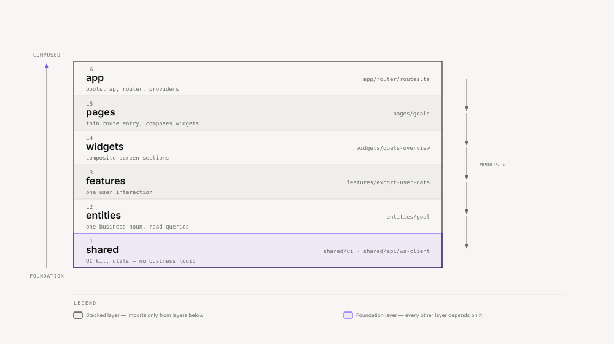

# ze-web frontend architecture

The React web client (`apps/ze-web`) uses [Feature-Sliced Design](https://feature-sliced.design/) (FSD). Spec: [specs/phases/082-ze-web-fsd/spec.md](../specs/phases/082-ze-web-fsd/spec.md).

## Layers



<sub>[Interactive version](diagrams/docs/frontend-layers.html)</sub>

<details>
<summary>Table</summary>

| Layer | Purpose | Name by | Example |
|-------|---------|---------|---------|
| `shared` | UI kit, utilities, API wiring — no business logic | — | `shared/ui` (primitives + layout), `shared/api/ws-client` |
| `entities` | One business noun: display + read queries | singular noun | `entities/goal` → `GoalCard`, `useGoalsQuery` |
| `features` | One user interaction | verb phrase | `features/export-user-data` |
| `widgets` | Composite screen sections | UI block role | `widgets/goals-overview` |
| `pages` | Thin route entry — composes widgets | route segment | `pages/goals` |
| `app` | Bootstrap, router, providers | — | `app/router/routes.ts` |

</details>

**Import rule:** a slice imports only from layers below it, via public `index.ts` exports. Enforced by `make lint-web` (`@feature-sliced/eslint-config`).

## Adding a new screen

Example: finance overview at `/finance`.

1. **`entities/transaction/`** — `TransactionRow`, `useTransactionsQuery` wrapping `@ze/client`
2. **`widgets/finance-overview/`** — composes entity list + `FloatingButton` from `features/open-context-overlay`
3. **`pages/finance/`** — `FinancePage` that renders `<FinanceOverview />`
4. **`app/router/routes.ts`** — add route with `label`, `icon`, `showInMobileNav`, and lazy import

Each slice exposes a public API through `index.ts`. Internal `ui/`, `api/`, `model/` folders are private to the slice.

Core-owned screens include `/skills` (`pages/skills` + `widgets/skill-management`) and `/workspace` (`pages/workspace`). See [skills.md](skills.md) and [workspace.md](workspace.md).

## Extending an existing domain

Example: goal detail view at `/goals/:goalId`.

1. Add `entities/goal/ui/GoalDetail.tsx` and optionally `useGoalQuery(id)`
2. Add `widgets/goal-detail/` composing the entity + any action features
3. Add `pages/goal-detail/` thin page
4. Register nested route in `app/router/routes.ts` (no nav meta needed if reached from list)

Do not put route-specific logic in entities — entities are reusable across screens.

## Adding a user action

Example: confirm recurring expense.

1. Create `features/confirm-recurring/` with hook or handler in `api/`
2. Use it from the widget that owns the UI (e.g. `widgets/finance-overview`)
3. Export through `features/confirm-recurring/index.ts`

Features import from `entities` and `shared` only — never from `widgets` or `pages`.

## Shared abstractions

- **`shared/ui/layout/ListPage`** — standard list screen shell (header, skeleton, error, empty, children)
- **`shared/lib/query-keys.ts`** — TanStack Query key factory; extend when adding REST resources
- **`app/router/routes.ts`** — single source for desktop + mobile nav metadata

## API and types

- REST and WebSocket types: `@ze/client` (generated — never raw URL strings)
- Server-driven UI: `@ze/ui`, `@ze/ui/react`
- Entity query hooks wrap `@ze/client` + `shared/lib/queryKeys`

## Shared UI

`shared/ui/` is the single UI slice:

| Subfolder | Contents |
|-----------|----------|
| `primitives/` | Generic building blocks (shadcn-style `Button`, `Input`, `Sheet`) |
| `layout/` | Ze screen patterns (`ListPage`, `PageHeader`, `EmptyState`, …) |

Import from the public API: `import { Button, ListPage } from "@/shared/ui"`.

## Configuration

`shared/config/app-config.ts` stores the server URL and API key in `localStorage`. Set them during onboarding or in Settings. No `VITE_*` env vars.

## Commands

```bash
make web          # dev server :5173
make web-build    # production build
make test-web     # vitest
make lint-web     # ESLint (FSD boundaries)
```

## Testing

Colocated `*.test.tsx` next to the module. Run from repo root: `make test-web`.
