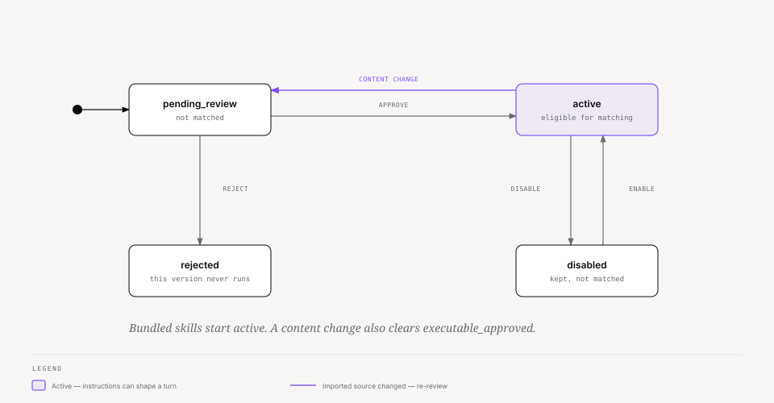
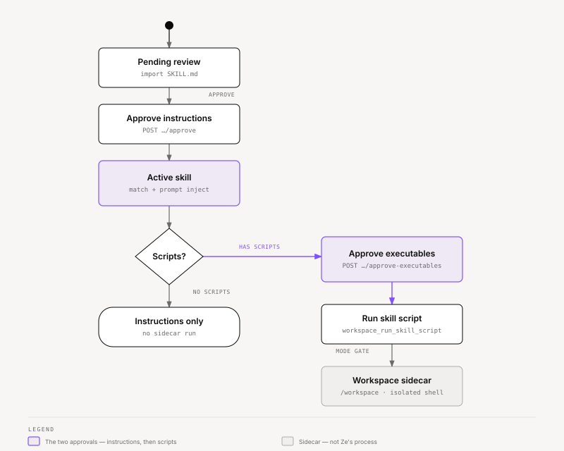

# Ze — Agent Skills

Skills add reusable instructions (and, after a second approval, scripts) to every
agent. They do not grant new tools. An imported skill cannot affect a conversation
until you review it. Scripts never inherit that approval — they run only after a
separate executable approval, and only inside the [workspace sidecar](workspace.md).

**Package:** `core/ze-skills/ze_skills/`  
**Web UI:** System `/skills` (`widgets/skill-management`)  
**Specs:** [114-agent-skills](../specs/phases/114-agent-skills/spec.md) ·
[115-workspace-sidecar](../specs/phases/115-workspace-sidecar/spec.md) (scripts)

---

## What a skill is

A skill is a named `SKILL.md` document in the open Agent Skills format: YAML
frontmatter plus a Markdown body. Ze stores it as a `Skill` row and, when the
archive includes extras, as reference files and script files.

| Piece | What it does |
|---|---|
| Instructions | Prepended to the agent's system prompt when the skill matches the turn |
| `allowed-tools` | Intersects (never unions) the agent's existing tool list |
| Reference files | Non-script extras (markdown, JSON, CSV, …) stored with the skill |
| Scripts | `.py` / `.sh` / `.js` / `.ts` / `.rb` / `.pl` files; run in the workspace only after executable approval |

Matching is **global**. An active skill is eligible on every agent. There is no
per-agent assignment.

Skills are not plugins. A plugin can *ship* bundled skills; the skill system itself
is core infrastructure that `ze-api` wires, the same way it wires memory and the
workspace.

---

## `SKILL.md` format

The file must start with a YAML frontmatter block. `name` and `description` are
required and must be non-empty. Ze rejects the import otherwise.

```markdown
---
name: weekly-review
description: Structure a weekly review of goals, loops, and calendar.
allowed-tools:
  - list_goals
  - workspace_read
scripts:
  - scripts/summarize.py
---

When the user asks for a weekly review, gather open goals and this week's
calendar, then write a one-page summary.
```

`allowed-tools` is optional. Naming a tool the agent does not have has no effect —
a restriction can only narrow access.

Ze sets `has_scripts` when the frontmatter lists `scripts:`, when the body
references a `scripts/…` path with a script extension, or when the imported zip
contains such a file.

---

## Import and review

Give Ze a URL to a `SKILL.md` or a zip that contains one. Ze fetches, parses, and
creates a `pending_review` row. It never activates the skill at import.

You review the parsed name, description, full instructions, tool restrictions, and
any script filenames on `/skills`. Then you approve or reject.

| Source | How it arrives | Review |
|---|---|---|
| **Imported** | `POST /api/v0/skills/import` with a URL | Required. Lands as `pending_review`. |
| **Bundled** | `ZePlugin.bundled_skill_paths()` at startup | Skipped. Lands as `active`. Developer-authored, trusted with the plugin. |

Two imported skills cannot share a slug. An imported skill and a bundled skill may
share a name; Ze distinguishes them by `(slug, source)`.

You cannot remove a bundled skill from the management UI. Disable it, or uninstall
the plugin.

---

## Status lifecycle



<sub>[Interactive version](diagrams/docs/skills-lifecycle.html)</sub>

| Status | Matching | Typical next step |
|---|---|---|
| `pending_review` | No | Approve or reject |
| `active` | Yes | Disable, or approve executables if it has scripts |
| `disabled` | No | Enable (no re-review unless content changed) |
| `rejected` | No | Kept as a record of that version |

Approving instructions does **not** set `executable_approved`. That flag is a
separate gate. See [Workspace integration](#workspace-integration).

---

## Matching

The `match_skills` graph node runs after `fetch_context`. It reads `SkillMatcher`
from `config["configurable"]` — `ze-core` never imports `ze_skills`.

Two independent paths combine on the same turn:

| Path | How | When it fires |
|---|---|---|
| **Automatic** | Cosine similarity of the message against each active skill's `name: description` embedding | Similarity ≥ `skills.match_threshold` (default `0.5`) |
| **Explicit** | `/skill-name` in the message (slash + slug) | Always, if that skill is active |

Explicit matches take precedence in the result list and still combine with any
other automatic matches. Several skills may apply on one turn; Ze applies all of
them.

Matched skills:

1. Prepend `[Skill: name]` plus the instructions body to the system prompt.
2. Intersect `allowed-tools` across every matched skill that declares a list. Skills
   with no list impose no extra restriction. The result only *narrows* the agent's
   tools, including platform workspace tools.
3. Show up on `MessageTrace.skills_used` (name, source, trigger, similarity,
   `script_ran`).

Type `/weekly-review` in chat to force that skill for the turn, even if automatic
matching would miss it.

---

## Tool narrowing

A skill cannot add a tool. `BaseAgent.agentic_loop` intersects
`AgentContext.skill_tool_names` with the agent's own `tools` list (and the
workspace platform tools, unless the agent sets `workspace_opt_out`).

If two matched skills both declare `allowed-tools`, Ze keeps the intersection.
If none declare a list, the agent keeps its full set.

---

## Bundled skills

A plugin ships skills by returning filesystem paths:

```python
def bundled_skill_paths(self) -> list[str]:
    root = Path(__file__).parent / "skills"
    return [str(root / "weekly-review" / "SKILL.md")]
```

`register_bundled_skills()` loads each path at startup with `source=bundled` and
`status=active`. The write is idempotent on `(slug, source)`. Bundled skills have
no `origin_url`, so refresh and the daily recheck skip them.

If a bundled skill includes scripts, those scripts still need executable approval
before `workspace_run_skill_script` will run them. Shipping the file is not
permission to execute it.

---

## Visibility

The Mind trace panel lists every skill used on the turn: name, source
(`bundled` / `imported`), trigger (`automatic` / `explicit`), similarity for
automatic matches, and a **script ran** mark when
`workspace_run_skill_script` succeeded.

The assistant bubble also shows a workspace chip when the sidecar ran on that
turn. Skill attribution itself lives on the trace, not as a separate bubble chip.

---

## Workspace integration

Skills without scripts stop at instructions. Skills with scripts need the
workspace — the isolated computer beside Ze — before anything executes.



<sub>[Interactive version](diagrams/docs/skills-workspace.html)</sub>

### Two gates

| Gate | Endpoint | Effect |
|---|---|---|
| Instructions | `POST /api/v0/skills/{id}/approve` | Skill becomes `active`. Matching and prompt injection start. Scripts do not run. |
| Executables | `POST /api/v0/skills/{id}/approve-executables` | Sets `executable_approved`. Requires the skill to already be `active` and `has_scripts`. |

A skill that you approved as instructions-only in the first skills phase does not
silently start running scripts. You must approve executables again.

A content-change recheck reverts the skill to `pending_review` **and** clears
`executable_approved`. Re-approve instructions, then re-approve executables.

Disabled and pending skills never run scripts.

### How a script actually runs

Matching a skill does **not** auto-exec its scripts. The agent (or unattended work
in Auto mode) calls `workspace_run_skill_script(skill_id, filename)`.

That tool:

1. Loads the skill. Refuses unless `status == active` and `executable_approved`.
2. Loads the stored script bytes from `skill_scripts`.
3. Asks `WorkspaceGate` (mode × action `run_script` × origin). Same table as
   other commands — see [workspace.md](workspace.md#modes).
4. Writes the file under `/workspace` and runs it in the sidecar (`python3` or
   `bash`). Ze secrets are not in the child environment.
5. Records a `workspace_runs` row with `skill_id` and `skill_script_path`, and
   sets `skills_used[].script_ran` on the turn's trace.

Plan mode returns a dry-run note. Ask and Auto-edit still confirm conversation
commands. Unattended goals and workflows may run scripts only when the workspace
mode is **Auto**.

The workspace page is `/workspace`. Executable approval stays on `/skills`.

Detached runs, automatic follow-up turns, and push when a run finishes are spec
116, not this path.

---

## REST

All routes sit under `/api/v0/skills` and require the API key.

| Method | Path | Purpose |
|---|---|---|
| `GET` | `/skills` | List, optional `status` / `source` filters |
| `GET` | `/skills/{id}` | Detail, including instructions and script filenames. Pending re-review includes `previous_version`. |
| `GET` | `/skills/{id}/reference-files/{filename}` | Stored reference-file content |
| `POST` | `/skills/import` | Fetch a URL; create `pending_review` |
| `POST` | `/skills/{id}/approve` | Instructions approval |
| `POST` | `/skills/{id}/approve-executables` | Script approval |
| `POST` | `/skills/{id}/reject` | Reject this version |
| `POST` | `/skills/{id}/disable` | Stop matching |
| `POST` | `/skills/{id}/enable` | Resume matching |
| `POST` | `/skills/{id}/refresh` | Re-fetch an imported origin URL |
| `DELETE` | `/skills/{id}` | Remove an imported skill |

Refresh of a bundled skill returns an error — there is no origin URL.

---

## Daily recheck

`SkillRecheckJob` (`job_id = skills_recheck`) re-fetches every imported skill's
`origin_url` on the cron in `skills.recheck` (default `0 6 * * *`).

| Outcome | Status | Notes |
|---|---|---|
| Content unchanged | Unchanged | Updates `last_checked_at` |
| Content changed | `pending_review` | Prior approved snapshot kept for comparison; `executable_approved` cleared |
| Source unreachable | Unchanged | Sets `last_check_error`; the last approved version keeps working |

You can trigger the same path with `POST /skills/{id}/refresh`.

---

## Configuration

`apps/ze-api/config/config.yaml`:

```yaml
skills:
  match_threshold: 0.5   # cosine floor for automatic matching
  recheck:
    enabled: true
    cron: "0 6 * * *"
```

See [configuration.md](configuration.md#skills) for the full block.

---

## Further reading

- [workspace.md](workspace.md) — sidecar modes, isolation, local and Fly setup
- [core/ze-skills/README.md](../core/ze-skills/README.md) — package modules
- [core/ze-workspace/README.md](../core/ze-workspace/README.md) — client, gate, tools
- [sdk.md](sdk.md#zeplugin--extension-point) — `bundled_skill_paths()`
- [adding-an-agent.md](adding-an-agent.md#5-bundle-a-skill-optional) — shipping a skill with a plugin
